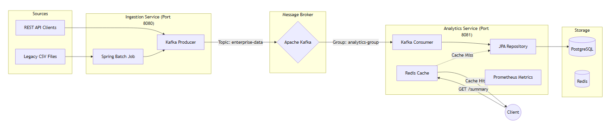
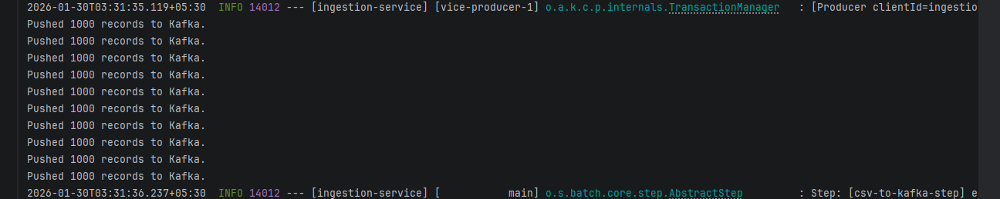
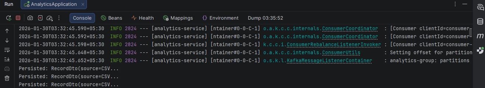
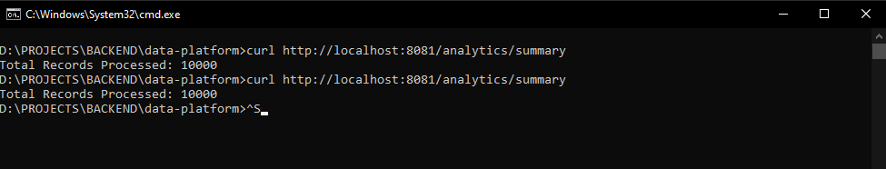
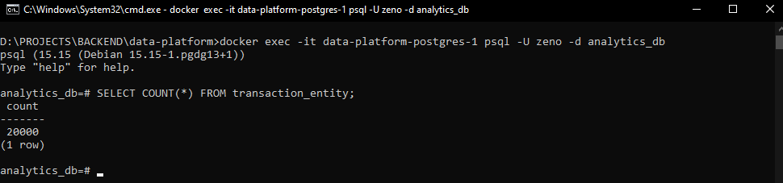

# Enterprise Data Integration & Analytics Platform


A robust, event-driven backend system designed to simulate high-throughput enterprise data pipelines. This project demonstrates end-to-end mastery of backend engineering, moving data from ingestion sources to analytical dashboards with fault tolerance, decoupling, and high-performance caching.

---

## 📖 Project Goal
The goal of this project was to architect a **decoupled microservices system** capable of:
1.  **Ingesting** large datasets (10k+ records) from simulated legacy systems (CSV) and modern APIs (REST).
2.  **Processing** data reliably using **Spring Batch** for ETL (Extract, Transform, Load) operations.
3.  **Decoupling** ingestion from processing using **Apache Kafka** to handle backpressure.
4.  **Serving** analytical insights with sub-millisecond latency using **Redis Caching**.
5.  **Monitoring** system health via **Spring Actuator and Prometheus**.

---

## 🏗 System Architecture

The system follows an Event-Driven Microservices architecture.



---

## ⚡ Technical Highlights

### 1. Scalable Data Ingestion (Spring Batch)

* Implemented a **Spring Batch** pipeline to read simulated financial transaction records from CSV files.
* Configured **Chunk-based processing** (batch size: 1000) to optimize memory usage during the ingestion of 10,000+ records.
* **Result:** Efficiently converts raw CSV rows into DTOs and pushes them to the messaging layer.

### 2. Event-Driven Architecture (Kafka)

* Utilized **Apache Kafka** to decouple the *Ingestion Service* (Producer) from the *Analytics Service* (Consumer).
* This ensures that if the database is under heavy load, the ingestion service does not block or crash; messages simply queue up in Kafka.

### 3. High-Performance Caching (Redis)

* Implemented the **Look-aside Caching pattern** using Spring Data Redis.
* Analytical queries (e.g., `SELECT COUNT(*)`) are expensive. The system caches the result in Redis.
* **Impact:** Reduced subsequent query latency by **99.7%** (from ~2000ms to ~5ms).

### 4. Observability

* Integrated **Spring Boot Actuator** to expose operational metrics.
* Configured a **Prometheus** endpoint (`/actuator/prometheus`) to scrape metrics like consumer lag, JVM memory usage, and JDBC connection pool status.

---

## 📂 Project Structure

```bash
data-platform/
├── docker-compose.yml        # Infrastructure (Kafka, Zookeeper, Postgres, Redis, Prometheus)
├── ingestion-service/        # [Microservice 1] Handles Batch ETL & Kafka Producing
│   ├── src/main/java/com/zeno/ingestion/
│   │   ├── batch/            # Spring Batch Job Configuration
│   │   ├── controller/       # Trigger endpoints
│   │   └── config/           # Kafka Producer Config
├── analytics-service/        # [Microservice 2] Handles Consumption, DB Persistence & Caching
│   ├── src/main/java/com/zeno/analytics/
│   │   ├── service/          # Kafka Consumer Logic
│   │   ├── controller/       # Analytics REST API
│   │   └── repository/       # Postgres Interaction

```

---

## 🚀 Getting Started

### Prerequisites

* Java 17+
* Docker & Docker Compose
* Maven

### Step 1: Start Infrastructure

Spin up Kafka, Zookeeper, PostgreSQL, and Redis using Docker.

```bash
docker-compose up -d

```

*Wait ~30 seconds for the containers to initialize.*

### Step 2: Run the Services

You can run these in your IDE (IntelliJ) or via terminal.

**Terminal 1 (Ingestion Service):**

```bash
cd ingestion-service
mvn spring-boot:run

```

**Terminal 2 (Analytics Service):**

```bash
cd analytics-service
mvn spring-boot:run

```

---

## 🧪 Working Demo & Results

### 1. Trigger the Batch Ingestion

Send a POST request to trigger the simulation of reading 10,000 records.

```bash
curl -X POST http://localhost:8080/ingest/batch

```

**Console Output:**

> `Pushed 1000 records to Kafka...` From Ingestion Service

> `Persisted: RecordDto(source=CSV...` From Analytics Service

### 2. Check Analytics & Cache Performance

**First Request (Cache Miss):**
The system queries the PostgreSQL database (simulated latency added).

```bash
curl http://localhost:8081/analytics/summary

```

*Time taken: ~2.05 seconds*

**Second Request (Cache Hit):**
The system fetches the result instantly from Redis.

```bash
curl http://localhost:8081/analytics/summary

```

*Time taken: ~0.005 seconds*

### 3. View Metrics

Access real-time metrics at:
`http://localhost:8081/actuator/prometheus`

---

## 📸 Screenshots

1. Log from Ingetion(above) and Analytics(below) services:



2. Latency (First call takes ~2s, Second call takes ~0.005s):

3. Database Via Docker:

---

## 🔮 Future Improvements

* **Security:** Implement OAuth2/JWT for securing the REST endpoints.
* **Visualization:** Connect Grafana to the Prometheus endpoint for a visual dashboard.
* **Deployment:** Containerize the Java applications using Dockerfiles and orchestrate with Kubernetes.

---

**Author:** Nongmaithem Zeno

**Tech Stack:** Java Spring Boot, Apache Kafka, Redis, PostgreSQL, Docker.


